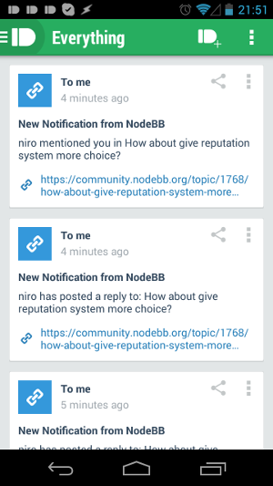
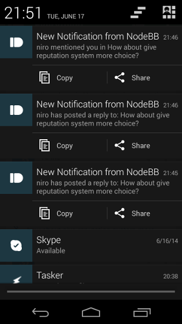
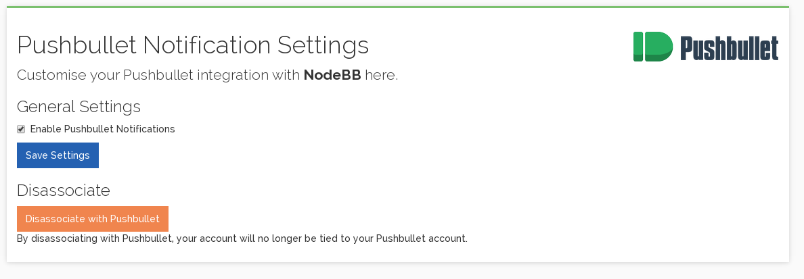
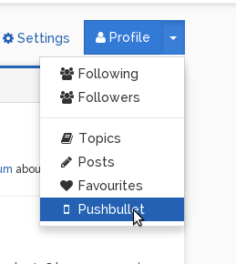

# Pushbullet Notifications

Allows NodeBB to interface with the Pushbullet service in order to provide push notifications to user mobile phones.

## Installation

    npm install nodebb-plugin-pushbullet

## Configuration

1. Install and activate this plugin.
1. [Register an application via the Pushbullet website](https://www.pushbullet.com/create-client), and obtain a client key and secret.
    * In particular, the `redirect_uri` should be your forum's URL with `/pushbullet/auth` appended to it (e.g. `https://community.nodebb.org/pushbullet/auth`)
1. Enter the client key and secret into the plugin's setup page (`/admin/pushbullet`), and save.
1. Reload NodeBB.

## Screenshots

